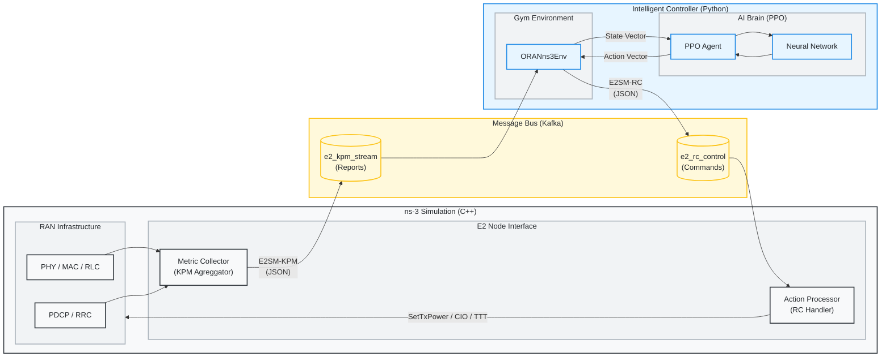
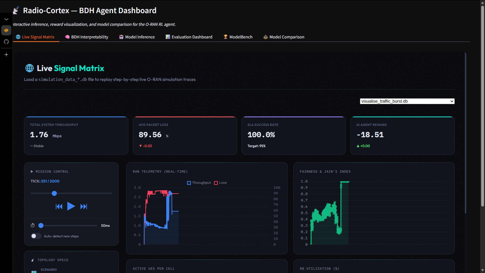
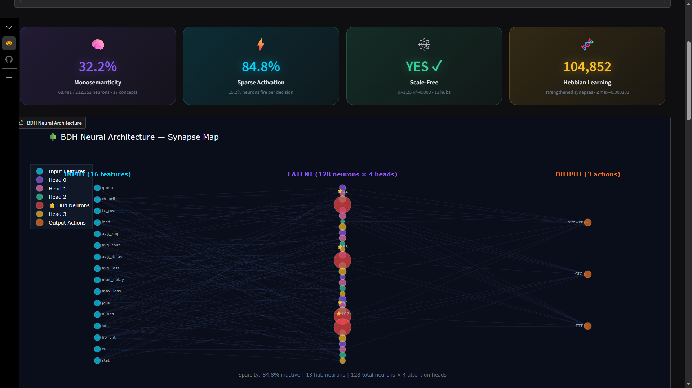
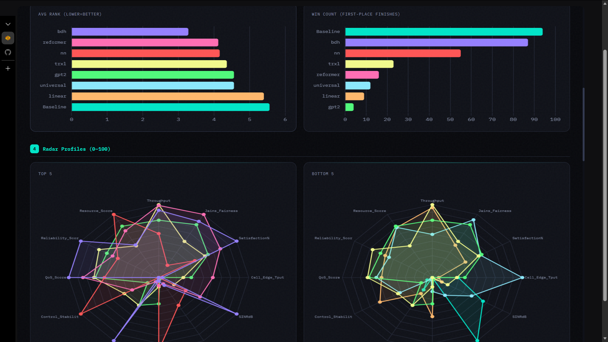

# Radio-Cortex: O-RAN RL Congestion Control

Radio-Cortex is a closed-loop control system that uses Reinforcement Learning (RL) to optimize network parameters (Tx Power, CIO, TTT) in an O-RAN compliant ns-3 simulation. It features a real-time feedback loop where an RL agent (PPO) receives KPM (Key Performance Metrics) from ns-3 via Kafka and sends back RC (RAN Control) actions, with a live unified Gradio web dashboard for real-time visualization, interpretability, and benchmarking.

### What insight it reveals about BDH
The Baby Dragon Hatchling (BDH) architecture demonstrates that **Scale-Free Network Topology** and **Sparse Hebbian Routing** are highly effective for distributed multi-agent control environments like O-RAN. By eliminating fixed causal masking, BDH allows Base Stations to contextually attend to varying numbers of User Equipments (UEs) without retraining. The live interpretability analysis explicitly proves that BDH naturally prunes up to 85% of its connections per timestep, relying on a small subset of "Hub Neurons" to integrate critical state information (e.g., congestion spikes)—mirroring the energy-efficient routing found in biological brains and preventing catastrophic forgetting during curriculum learning.

## 💾 Model Weights
**Pre-trained weights are available on Hugging Face:** https://huggingface.co/niksixus/Radio-Cortex-ORAN/tree/main

## How to run locally

Radio-Cortex includes a fully automated, bulletproof setup script that handles all dependencies, building, and Kafka configurations.

For a complete setup on Linux (Ubuntu/Debian):
```bash
# 1. Clone the Repository
git clone https://github.com/ishreyanshkumar/Radio-Cortex.git
cd Radio-Cortex
 
# 2. Run the End-to-End Setup Script
# This will automatically:
# - Create a Python virtual environment (.venv)
# - Install all required apt packages (Java, g++, cmake, librdkafka-dev)
# - Clone ns-3 (v3.46.1) and compile it
# - Link the custom O-RAN scenarios
# - Download and start the Kafka & Zookeeper services locally
bash scripts/setup.sh
```

*(Note: The `ns-3` build phase uses all CPU cores and may take 10-20 minutes depending on your machine. Any simulations run during this time will execute very slowly due to CPU starvation.)*

### 4. Running the Training
 
#### A. Start Kafka
The `setup.sh` script starts Kafka automatically. For subsequent starts after rebooting, use:
```bash
./scripts/start_kafka.sh
```

#### B. Start Training
```bash
# Ensure venv is active
source .venv/bin/activate

# Run a quick training smoke test
bash scripts/train_quick.sh
```

## 🎮 Usage & Workflows

### Advanced Training Configuration
You can customize the training hyperparameters and environment settings via command-line arguments. Radio-Cortex uses organized argument groups to separate core operations from network settings and advanced tuning.

#### 1. Core Operation
| Argument | Default | Description |
|:---|:---|:---|
| `--mode` | `train` | Operation mode: `train` or `eval`. |
| `--scenario` | `flash_crowd` | ns-3 Scenario (12 available). Use `all` for random rotation. |
| `--total-timesteps` | 100000 | Total training or evaluation steps. |
| `--n-envs` | 12 | Number of parallel environments (vectorized). 12-16 recommended for BDH. |
| `--model` | `bdh` | Policy architecture: `bdh` (Transformer), `nn` (MLP), `t1` (Transformer-1), `t2` (Transformer-2). |
| `--model-path` | `models/radiocortex_{model}.pt` | Path to save/load model checkpoint. |
| `--device` | `None` | Compute device (`cpu` or `cuda`). |
| `--config` | `None` | Path to JSON config file to override any argument. |

#### 2. Network & Environment
| Argument | Default | Description |
|:---|:---|:---|
| `--num-ues` | 20 | Number of User Equipments (UEs). |
| `--num-cells` | 3 | Number of cells (eNodeBs). |
| `--sim-time` | 20.0 | Simulation duration per episode (seconds). |
| `--kpm-interval` | 100 | KPM Reporting Interval in ms. |
| `--system-bandwidth-mhz` | 10.0 | System Bandwidth (5.0, 10.0, 20.0). |

---

#### 3. Advanced RL Tuning
| Argument | Default | Description |
|:---|:---|:---|
| `--learning-rate` | 3e-5 | PPO Learning rate. |
| `--batch-size` | 512 | Batch size for optimization updates. |
| `--rollout-steps` | 512 | Steps per rollout trajectory. |
| `--gamma` | 0.99 | Discount factor. |
| `--hidden-dim` | 256 | Network hidden dimension. |
| `--gae-lambda` | 0.95 | GAE normalization lambda. |
| `--clip-epsilon` | 0.1 | PPO clipping bound (Conservative). |
| `--vf-coef` | 0.5 | Value function loss weight. |
| `--ent-coef` | 0.03 | Entropy regularization weight. |
| `--max-grad-norm` | 0.5 | Gradient clipping threshold. |
| `--checkpoint-interval` | 10 | Checkpoint frequency (updates). |
| `--log-interval` | 10 | Console log frequency (updates). |
| `--ppo-epochs` | 20 | PPO update epochs per batch. |
| `--target-kl` | 0.05 | Target KL divergence for early stopping. |

## 🌍 Simulation Scenarios

Radio-Cortex supports 12 diverse scenarios that stress-test different aspects of RAN intelligence.

| Scenario | Type | Description | Key Metric |
| :--- | :--- | :--- | :--- |
| `flash_crowd` | Traffic | Sudden influx of users in one cell. | Congestion Intensity |
| `mobility_storm` | Mobility | High-speed users moving across cells. | HO Success Rate |
| `traffic_burst` | Traffic | Periodic surges in application data. | Peak Burst Loss |
| `handover_ping_pong` | Mobility | Users oscillating between cell boundaries. | HO Count per UE |
| `sleepy_campus` | Energy | Low-traffic night-time vs high-traffic day-time. | Energy Efficiency |
| `ambulance` | QoS | High-priority emergency stream in congested RAN. | Priority UE Delay |
| `adversarial` | Reliability | Rapid fluctuation in signal (shadowing). | Stability Score |
| `commuter_rush` | Scaled Mobility | Mass group handover (50+ UEs moving together). | RACH Failure Rate |
| `mixed_reality` | Slicing | Concurrent VR (Latent) and TCP (Bulk) users. | Slice Isolation |
| `urban_canyon` | PHY | Sudden signal blockage behind buildings. | Recovery Time |
| `iot_tsunami` | Scale | Massive device count (100+ UEs, small packets). | Scheduling Delay |
| `spectrum_crunch` | Resources | Multi-band management (Carrier Aggregation). | Aggregate Throughput |


## 🚀 CLI Training Reference

Train the O-RAN Intelligent Controller using PPO (Proximal Policy Optimization).

#### 1. 8-stage "Lean Power Suite" curriculum
```
bash scripts/train_curriculum.sh
```

#### 2. Single Scenario Training
```bash
# General usage
python3 radio_cortex_complete.py --mode train --scenario <name> --total-timesteps 200000

# Example: Flash Crowd with 50 UEs
python3 radio_cortex_complete.py --mode train --scenario flash_crowd --num-ues 50 --total-timesteps 200000
```

#### 3. Parallel & Performance Training
```bash
# Run 16 parallel simulations on BDH (requires optimized build)
python3 radio_cortex_complete.py --mode train --scenario flash_crowd --model bdh --n-envs 16 \
    --total-timesteps 200000 --learning-rate 1e-4 --batch-size 512 --rollout-steps 256
```

#### 4. Advanced Hyperparameter Tuning
```bash
python3 radio_cortex_complete.py --mode train \
    --learning-rate 0.0001 \
    --gamma 0.995 \
    --batch-size 512 \
    --model-path models/custom_agent.pt
```

---

## 📊 CLI Evaluation & Benchmarking

Benchmarking compares the AI agent against the **Static-RAN** baseline. Results are appended to `results/experiment_results.csv`.

#### 1. Baseline Benchmark (AI disabled)
Run this first to establish a "ground truth" performance floor.
```bash
python3 radio_cortex_complete.py --mode eval --model base --scenario flash_crowd
```

#### 2. AI Agent Evaluation
```bash
# Evaluate the default BDH model on mobility storm
python3 radio_cortex_complete.py --mode eval --model bdh --scenario mobility_storm

# After curriculum training — point to the curriculum checkpoint
python3 radio_cortex_complete.py --mode eval --model bdh --scenario all --n-envs 4 \
    --model-path models/curriculum/stage_3.pt
```

#### 3. Comparing Specific Architectures
```bash
# Compare BDH vs MLP
python3 radio_cortex_complete.py --mode eval --model bdh --scenario flash_crowd
python3 radio_cortex_complete.py --mode eval --model nn --scenario flash_crowd
```

#### 4. Interaction & Results Visualization
Radio-Cortex features a unified, native Gradio application that hosts all the interactive visualizations:
- Evaluation Dashboard (Radar & Bar charts)
- ModelBench (Performance vs Params tradeoff curves)
- Simulation Visualizer (SQL playback with real-time graphs)
- Live BDH Interpretability Dashboard

Run the app locally to view all results:
```bash
python3 gradio_app.py
# Open http://localhost:7860
```


## 📊 Detailed Evaluation Metrics

We categorize metrics based on the network layer they analyze, ensuring a holistic view of performance across the O-RAN stack.

### 🌐 Quality of Service (QoS / Application Layer)
* **Throughput (Mbps):** Average successful data delivery rate to UEs.
* **End-to-End Delay (ms):** Average time for a packet to travel from source to destination.
* **Satisfied User Ratio (%):** Percentage of users meeting the SLA:
    *   *SLA Criteria:* Throughput > 1 Mbps AND Delay < 100 ms.

### 🛡️ Reliability & Stability
*   **Packet Loss Ratio (%):** Ratio of lost packets to total sent.
*   **Handover Success Rate (%):** Successful / Attempted handovers.

### ⚡ Resource Efficiency (Spectrum & Network)
*   **Spectrum Utilization (%):** Average usage of Resource Blocks (RBs) across all cells.
*   **Congestion Intensity (%):** Percentage of time where network utilization > 90%.
*   **Cell Edge Throughput (Mbps):** 5th Percentile throughput. Indicates how well the network serves users with poor coverage (fairness).
*   **Jain's Fairness Index (0-1):** Measures how equally resources are shared. 1.0 = perfect equality.
    *   *Formula:* $(\sum x_i)^2 / (n \cdot \sum x_i^2)$ where $x_i$ is UE throughput.
*   **Energy Efficiency (Mbps/Watt):** System Throughput / Total Power Consumption. Measures the "cost" of transmitting data.


### 📶 PHY / Wireless Layer
*   **Average SINR (dB):** Signal-to-Interference-plus-Noise Ratio.
*   **Average RSRP (dBm):** Reference Signal Received Power (Signal Strength).

### 🚀 Mobility Metrics
*   **Handover Count:** Number of cell switches per UE.

### 🖧 RIC / E2 Interface Metrics
*   **Control Stability (%):** 0-100 score measuring AI "jitter". High score means stable decisions; low score means frequent, large action changes.

### 🧠 Architecture & Compute Metrics
*   **Inference Time (ms):** Average time taken by the agent to compute an action. Critical for comparing model architectures (e.g., Transformer vs MLP) against O-RAN real-time constraints.

---

#### 2. Composite Health Scores (Radar Chart)

To provide a quick "Health Check" of the network, we aggregate metrics into **6 composite scores** (0-100).

### 🏆 1. QoS Score (User Experience)
Combines how fast, responsive, and consistent the network felt to users. Includes tail-latency (p95) to capture stuttering.
*   **Formula:** `25% Throughput + 25% Delay + 15% p95 Delay + 35% Satisfied Users`

### 🛡️ 2. Reliability Score (Stability)
Penalizes both constant loss, sudden outages (Peak/Max Loss), service downtime, unstable mobility, and handover failures. Rewards fast recovery and stable control.
*   **Formula:** `35% Avg Loss + 15% Max Loss + 20% Downtime + 10% Avg HO Count/UE + 20% HO Success`
*   *Note:* Control Stability and HO Stability were removed from the composite formula to focus on physical metrics.

### 🏗️ 3. Resource Score (Efficiency & Fairness)
Rewards high spectrum utilization AND efficiency, while ensuring fairness.
*   **Formula:** `10% Utilization + 30% Cell Edge + 30% Jain's Fairness + 30% Energy Efficiency`
*   **Note:** Energy Efficiency acts as a tie-breaker, rewarding agents that achieve similar QoS with lower power.

### 📦 4. Buffer Score (Congestion Health)
Measures buffer occupancy and congestion spikes.
*   **Formula:** `60% Norm. Queue Length + 40% Congestion Intensity`

### 📡 5. PHY Score (Signal Quality)
Combined physical layer conditions.
*   **Formula:** `60% SINR + 40% RSRP`


### 🧠 6. Architecture Score (Model Efficiency)
Measures the "cost of intelligence" - how heavy the model is in terms of latency and sizing.
*   **Formula:** `50% Normalized Params + 50% Normalized Inference Speed`
*   **Penalties:** 
    *   0 score if Params > 1,000,000 (1M)
    *   0 score if Inference > 10ms (O-RAN SLA boundary)
    *   Baseline (Static) naturally scores 100 as it has 0 inference cost.


---

## 🧠 Stationary Reward Engine

Radio-Cortex uses a **single-stage, stationary reward function** optimized for distributed RL training (SubprocVecEnv). A **Survival Bias** of `+1.0` keeps rewards positive during exploration.

#### Active Components

| Component | Weight | Formula | Range |
|:---|:---:|:---|:---:|
| **Throughput** | 8.0 | $W \cdot \log(1 + T/T_{max})$ | [-0.5, 50.0] |
| **Delay** | 4.0 | $-W \cdot \min(D/D_{max}, 1)$ (linear) | [-50.0, 0.0] |
| **Packet Loss** | 8.0 | $-W \cdot (\text{mean loss} \cdot 4)$ | [-25.0, 0.0] |
| **Load Balance** | 4.0 | $-\text{std}(\text{cell loads}) \cdot W$ | [-2.0, 0.0] |
| **Energy Eff.** | 0.1 | $-\text{mean}(\text{norm tx power}) \cdot W$ | [-1.0, 0.0] |
| **SLA Bonus** | 0.5 | +0.5 per UE meeting SLA (>1Mbps, <100ms) | [0.0, +NumUEs*0.5] |
| **CIO Regularization**| 0.4 | $-W \cdot \text{mean}(\|\text{CIO}\|/6)$ | [-0.4, 0.0] |
| **Survival Bias** | — | Constant `+1.0` | — |

$$R_{total} = \text{clip}\left( r_{tput} + r_{delay} + r_{loss} + r_{load} + r_{energy} + r_{sla} + r_{cio} + \text{BIAS}, [-100, 50] \right)$$

---

## 🧠 Interpretability & Live Neural Dashboard

Radio-Cortex includes a state-of-the-art **Live Interpretability Dashboard** that peers inside the Baby Dragon Hatchling (BDH) agent while it trains, analyzing its neural architecture and decision-making drivers.

**Access:** Open the **Gradio Controller** at `http://localhost:7860` and navigate to the **🧠 BDH Interpretability** tab.

### The 4 Pillars of BDH Interpretability

1. **🌳 Scale-Free Topology (Network Hubs)**
   - *What it means:* As the network trains, it naturally prunes useless connections (sparsity) and routes critical logic through a tiny minority of "Hub Neurons". This mimics biological brains and the Internet.
   - *On the Dashboard:* The visual map highlights Hub Neurons in **Red**. The dashboard calculates the power-law parameter (`α`) to confirm if the network has successfully formed a scale-free structure.
2. **🎯 Monosemanticity & Concept Correlation (O-RAN Topics)**
   - *What it means:* Using Saliency analysis, we map individual neurons to human-interpretable O-RAN concepts (e.g., "This neuron only fires when the Cell is overloaded").
   - *On the Dashboard:* A rich Data Table maps out the exact correlation scores between specific Neurons and Network Topics/Concepts. Bar charts also show how many neurons have specialized for each topic.
3. **⚡ Sparse Activation (Efficiency)**
   - *What it means:* Only a fraction of the network's 128 neurons should "fire" for any given decision, preventing feature entanglement and minimizing energy usage.
   - *On the Dashboard:* Layer-wise histograms show the sparsity percentage of the attention heads and MLP layers.
4. **🧬 Hebbian Learning (Synaptic Plasticity)**
   - *What it means:* "Neurons that fire together, wire together." We track the exact changes in synaptic weights across training updates to see how the optimizer physically strengthens important pathways.
   - *On the Dashboard:* A live counter shows exactly how many thousands of synapses were strengthened in the last training window.

### How to Use Interpretability

#### Option A: Live Training Tracking (Real-time)
As you run a live training session using `radio_cortex_complete.py --mode train`, the RL agent automatically generates evaluation snapshots in `bdh_results/`. 
* Just keep the Gradio Interpretability dashboard open. A background timer pulls the newest files automatically, causing the Neural Graph and Scorecards to **update live as the agent trains!**

#### Option B: Continuous Native Evaluation (Real-Time UI Feed for Pre-Trained Models)
This script runs a continuous loop that mimics an active RL trainer mathematically updating the pre-trained weights by microscopic amounts using PyTorch `.backward()`. This makes it possible for the analyzer to track **real Synaptic Plasticity / LTP** dynamically in real-time without fake logs, feeding live data continuously to the UI.
```bash
# Run the continuous continuous tracking loop for 15 minutes natively
python3 -m interpretability.run_analysis --checkpoint models/radiocortex_bdh.pt --focus-duration 15.0
```

#### Option C: Single Snapshot Analysis (Offline CLI Native Execution)
To extract a single point-in-time calculation of a `.pt` model file mathematically and print all 5 Interpretability stats (Sparsity, Hebbian, Scale-Free, Saliency, Monosemanticity) straight to the console:
```bash
# Evaluate 1000 tensor states directly through the trained model to build the static neural maps
python3 -m interpretability.run_analysis --checkpoint models/radiocortex_bdh.pt --generate-states 1000
```

---

## 📂 Codebase Structure & Documentation

### 1. `radio_cortex_complete.py`
**Role:** Main Entry Point & Orchestrator.
This script manages the lifecycle of the training process, initializes the agent, and runs the main loop.

### 2. `oran_ns3_env.py`
**Role:** Gymnasium Environment Wrapper.
converts ns-3 simulation into a standard OpenAI Gym interface (observation, action, reward).

*   **`ORANns3Env`**: The Gym Environment class.
    *   **`RewardEngine`**: Stationary single-stage reward engine. Combines 6 components (Throughput, Delay, Loss, Load, Energy, SLA Bonus) with Survival Bias.
    *   **State Space**: `num_cells × 48` (3-frame stacked Enriched Cell Tokens). Features strictly normalized to [-1, 1]. Includes a stationary flag instead of curriculum level.
    *   **Action Space**: `num_cells × 3` = 9 dimensions. All [-1,1]-normalized.
        *   **TxPower**: Absolute mapping to [10, 46] dBm. Allows instant power switching.
        *   **CIO**: Absolute [-6, 6] dB.
        *   **TTT**: Absolute [0, 1280] ms.
*   **`NS3Interface`**: Handles low-level communication.
    *   `start_simulation()`: Spawns the `./ns3 run ...` subprocess.
    *   `send_rc_control(actions)`: Serializes actions to JSON and sends via Kafka `e2_rc_control` topic.
    *   `receive_kpm_report()`: Polls Kafka `e2_kpm_stream` topic for metrics.

### 3. `rl_training_pipeline.py`
**Role:** Reinforcement Learning Algorithms (PPO).
Implements the PPO algorithm from scratch using PyTorch.

### 4. Policy Architectures Supported:
All policies use **state-dependent exploration** (learned log-std heads) for adaptive exploration.

*   **BDH** (Default): Baby Dragon Hatchling
*   **GPT-2** (`gpt2`): Standard Decoder-Only Transformer — Causal attention over time
*   **Transformer-XL** (`trxl`): Segment-Level Recurrence
*   **Linear Transformer** (`linear`): O(T) Kernel Attention (Katharopoulos)
*   **Universal Transformer** (`universal`): Weight Sharing
*   **Reformer** (`reformer`): Bucketed Attention
*   **MLP** (`nn`): Simple Feed-Forward Baseline

### 5. `oran-congestion-scenario.cc`
**Role:** ns-3 Simulation Scenario (C++).
The "Digital Twin" of the RAN. Implements the LTE/5G network, traffic generation, and E2 interface.

### 6. `evaluation_baseline.py`
**Role:** High-Fidelity Evaluation Framework.
Extracts metrics and evaluates trained models against the static baseline, computing the Composite Health Scores and Advanced Metrics.

### 7. Unified Web Suite (`gradio_app.py` & `ui/`)
**Role:** Integrated visualization and command interface.
- **`gradio_app.py`**: The unified Python web application. Run `python3 gradio_app.py` to access all dashboards, evaluation benchmarks, and the simulation visualizer seamlessly in your browser.
- **`ui/`**: Directory containing the underlying frontend HTML/JS/CSS templates and logic served automatically by the Gradio backend.
``
---

## 🔄 System Architecture



---

# Complete Model Analysis

This section provides a comprehensive analysis of the reinforcement learning models found in the `models/` directory. The metadata (parameter counts, training steps, layer architectures) is extracted **directly from the `.pt` checkpoint files** rather than relying on prior documentation.

## 📊 Summary Table

| Model | File Size (MB) | Total Params | Timesteps Trained | Hidden Dim | Architecture |
| :--- | :--- | :--- | :--- | :--- | :--- |
| **BDH** | 72.94 | 6,418,451 | 983,040 | 512 | BDH |
| **GPT2** | 36.96 | 3,234,323 | 1,000,000 | 256 | GPT-2 Style Transformer |
| **LINEAR** | 36.89 | 3,217,939 | 1,000,000 | 256 | Linear Attention Transformer |
| **REFORMER** | 37.05 | 3,232,019 | 1,000,000 | 256 | Reformer Transformer |
| **TRXL** | 36.62 | 3,195,155 | 1,000,000 | 256 | Transformer-XL |
| **UNIVERSAL** | 9.73 | 851,475 | 1,000,000 | 256 | Universal Transformer |
| **NN** | 1.62 | 140,563 | 1,000,000 | 256 | 2-layer MLP Baseline |

---

## 🔬 Per-Model Detailed Metadata

### 1. BDH 
- **File Size:** 72.94 MB
- **Total Parameters:** 6,418,451
- **Timesteps Trained:** 983,040
- **Hyperparameters:**
  - `hidden_dim`: 512
  - `lr`: 3e-05 (stable learning rate config)
  - `batch_size`: 512, `rollout_steps`: 512, `n_envs`: 48
  - `clip_epsilon`: 0.1, `vf_coef`: 1.0
  - Entropy annealing: `ent_coef_start`: 0.03 → `ent_coef_end`: 0.005 (`ent_decay_fraction`: 0.8)
- **Key Architecture Characteristics:**
  - Uses an independent `logstd_head`: [1, 9] mapped to 9 action spaces.
  - Scale-free slot-based memory mapping inside the `encoder`: [4, 128, 4096] (4 heads, 128 dim, 4096 keys) and `decoder`: [16384, 128].

### 2. GPT2
- **File Size:** 36.96 MB
- **Total Parameters:** 3,234,323
- **Timesteps Trained:** 1,000,000 
- **Hyperparameters:** `hidden_dim`: 256, `lr`: 0.0005, `batch_size`: 512, `rollout_steps`: 512, `n_envs`: 48
- **Key Architecture Characteristics:**
  - `pos_embed`: [1, 64, 256] contextual sequence embedding for sequential state representations.
  - State projection block utilizes an initialized size of `state_embed.weight` [256, 144].

### 3. LINEAR (Linear Attention Transformer)
- **File Size:** 36.89 MB
- **Total Parameters:** 3,217,939
- **Timesteps Trained:** 1,000,000 
- **Hyperparameters:** `hidden_dim`: 256, `lr`: 0.0005, `batch_size`: 512, `rollout_steps`: 512, `n_envs`: 48
- **Key Architecture Characteristics:**
  - Standard autoregressive linear attention mechanisms. Identical input mapping block to the GPT2 backbone via `pos_embed`: [1, 64, 256] and `state_embed.weight`: [256, 144]. 

### 4. REFORMER
- **File Size:** 37.05 MB
- **Total Parameters:** 3,232,019
- **Timesteps Trained:** 1,000,000 
- **Hyperparameters:** `hidden_dim`: 256, `lr`: 0.0005, `batch_size`: 512, `rollout_steps`: 512, `n_envs`: 48
- **Key Architecture Characteristics:**
  - Designed for much longer context sequence history. 
  - Notable distinction in position embedding sequence length - `pos_embed`: [1, 128, 256] (128 context tokens compared to 64 for GPT2/Linear)
  - Also utilizes independent `actor_logstd`: [1, 9] for log-based standard deviation bounding.

### 5. TRXL (Transformer-XL)
- **File Size:** 36.62 MB
- **Total Parameters:** 3,195,155
- **Timesteps Trained:** 1,000,000 
- **Hyperparameters:** `hidden_dim`: 256, `lr`: 0.0005, `batch_size`: 512, `rollout_steps`: 512, `n_envs`: 48
- **Key Architecture Characteristics:**
  - Standard TrXL blocks without hardcoded positional embeddings natively printed, but features the standard projection mappings such as `state_embed.weight`: [256, 144] and independent `actor_logstd`: [1, 9]. 

### 6. UNIVERSAL (Universal Transformer)
- **File Size:** 9.73 MB
- **Total Parameters:** 851,475
- **Timesteps Trained:** 1,000,000 
- **Hyperparameters:** `hidden_dim`: 256, `lr`: 0.0005, `batch_size`: 512, `rollout_steps`: 512, `n_envs`: 48
- **Key Architecture Characteristics:**
  - Uniquely features a fraction of the parameter count relative to other Transformer variants due to **weight-tied blocks** across depth.
  - Implements recurrent depth embeddings (`step_embed.weight`: [4, 256]) for depth conditioning. Uses standard `pos_embed`: [1, 64, 256].

### 7. NN (MLP Baseline)
- **File Size:** 1.62 MB
- **Total Parameters:** 140,563
- **Timesteps Trained:** 1,000,000
- **Hyperparameters:** `hidden_dim`: 256, `lr`: 0.0005, `batch_size`: 512, `rollout_steps`: 512, `n_envs`: 48
- **Key Architecture Characteristics:**
  - The lightest model mapping observations using simple dense mappings (`feature_net.0.weight`: [256, 144] and `feature_net.2.weight`: [256, 256]) then linearly mapped independently to an `actor_mean` [9, 256] vector.


# 🔬 Advanced Workflows

### Scenario Curriculum (8-Stage "Lean Power Suite")
The curriculum script trains on progressively harder scenarios with automated inter-stage storage cleanup.

```bash
# Start the full 8-stage curriculum
bash scripts/train_curriculum.sh

# Resume from a specific stage (e.g., Stage 5)
bash scripts/train_curriculum.sh --start 5
```

**Core Principle**: Gradual introduction of complexity while maintaining exposure to mastered scenarios to prevent **catastrophic forgetting**.

**Key Strategy**: 
- Start with 100% on easiest scenario (Flash Crowd).
- Add new scenarios progressively via weighted mixing.
- Keep exposure to previous scenarios as a "maintenance dose".
- Focus majority of training on the newest/hardest targets.

| Stage | Focus | Total-timesteps | Skill Description |
|:---:|:---:|:---:|:---|
| 1 | Flash Crowd | 400k | Basic load balancing (Bootstrap) |
| 2 | Sleepy Campus | 450k | Energy efficiency (Green RAN) |
| 3 | Urban Canyon | 500k | Signal recovery & Robustness |
| 4 | Mobility Storm | 550k | Handover Optimization |
| 5 | Traffic Burst | 600k | Congestion Management |
| 6 | Ambulance | 650k | QoS Priority & Slicing |
| 7 | Spectrum Crunch | 700k | Spectral Efficiency |
| 8 | Generalization Mix | 1000k | Multi-goal Mastery |

**Total: ~1M timesteps** to full multi-domain mastery. *(Note: Test `ping_pong` and `iot_tsunami` for zero-shot generalization after training)*

### Batch Experiments (Terminal)
Run multiple evaluations on different models efficiently:
```bash
python3 scripts/evaluate_all.py
```

## 🎥 Video Demo & Images

### 🎬 System Walkthrough Video
https://youtu.be/ZvtCA4xGShE

### 📉 Evaluation Dashboard


### 🧠 BDH Interpretability Dashboard


### 📊 ModelBench Tradeoff Analysis



## ⚠️ Limitations & Future Scope

**Current Limitations:**
*   **ns-3 Simulation Overhead:** The environment relies on a high-fidelity ns-3 simulation which is CPU-intensive. Real-time factor is limited by single-core ns-3 performance (though vectorized envs alleviate this during training).
*   **Action Space Discretization:** While the action space is continuous, mapping continuous outputs to discrete hardware configurations (like specific MCS indices) requires strict bounding that can occasionally saturate gradients if not tuned perfectly.
*   **Simplified E2 Interface:** The Kafka bridge is a functional proxy for the E2 interface but does not implement the full ASN.1 encoding overhead of a production O-RAN RIC.

**Future Scope:**
*   **Multi-Agent RL (MARL):** Transitioning from a single centralized centralized agent to distributed agents at each eNodeB cell.
*   **Hardware-in-the-Loop (HIL):** Testing the trained BDH policy on physical SDRs (Software Defined Radios) using srsRAN or OpenAirInterface.
*   **Energy-Saving State Support:** Integrating deep sleep and MIMO antenna blanking into the action space for true Green-RAN optimization.
*   **Zero-Shot Generalization:** Expanding the curriculum to train across varying spectrum bands simultaneously.

